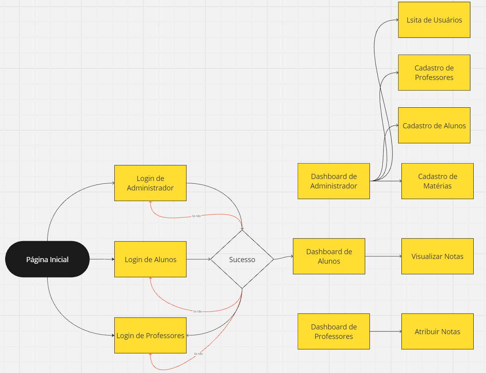
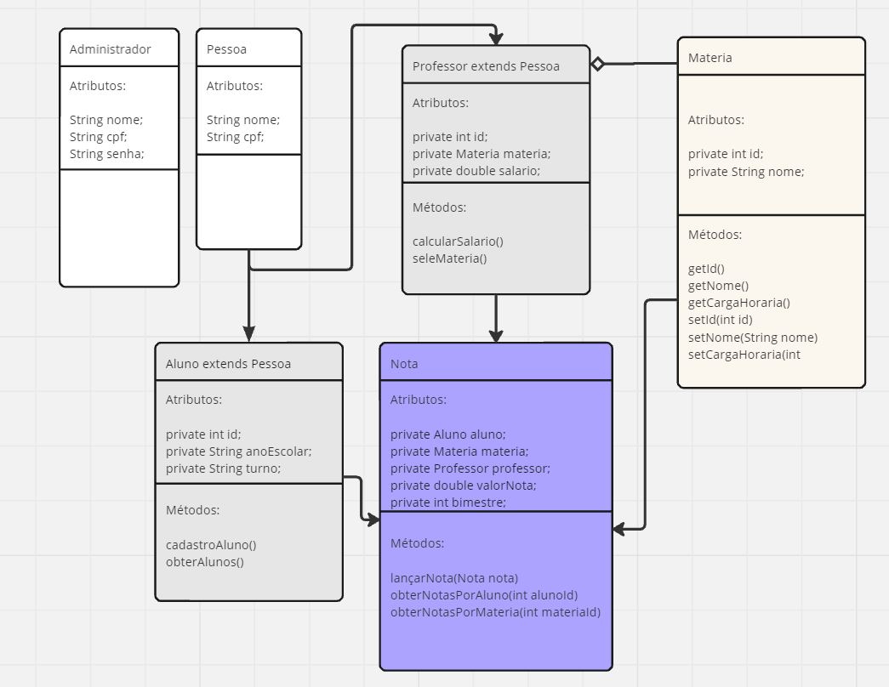
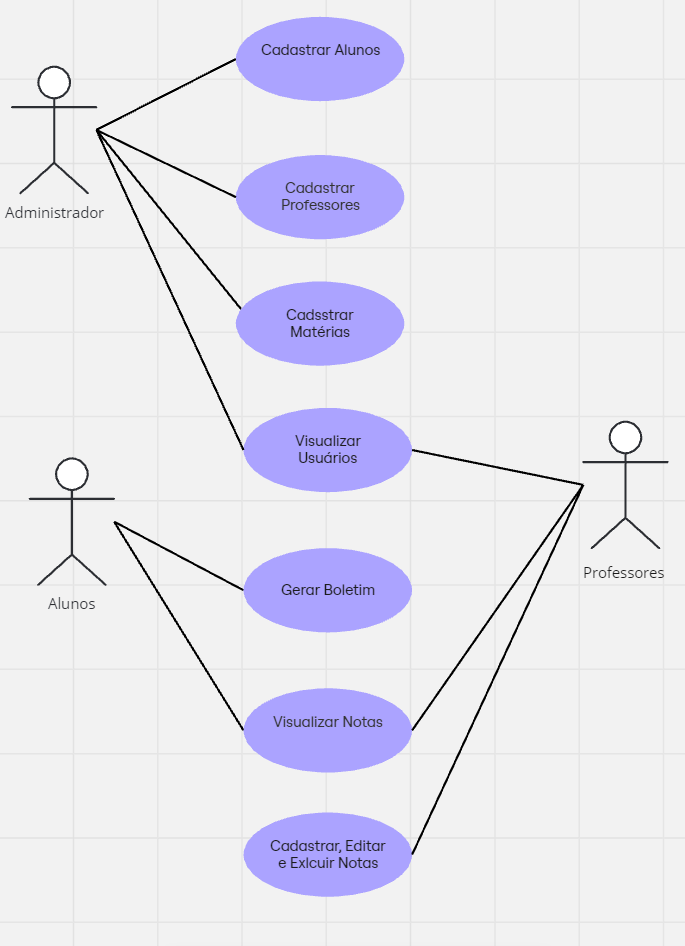

# EscolaJava4

---

# Sistema de Gestão Escolar

## Contexto do Projeto
O Sistema de Gestão Escolar será uma aplicação desktop desenvolvida em Java, utilizando Swing para a construção da interface gráfica. A aplicação permitirá que um administrador faça o cadastro de professores e alunos. Os professores poderão associar suas matérias e lançar notas para os alunos, que poderão visualizar suas notas e gerar o boletim das suas disciplinas.

---

## Escopo do Projeto
O Sistema de Gestão Escolar visa gerenciar o cadastro de professores e alunos, permitindo que os professores lancem notas e adicionem anotações de recuperação para os alunos. A arquitetura do sistema será construída com uma interface gráfica intuitiva e de fácil utilização, que possibilita futuras expansões, como a inclusão de funcionários administrativos.

---

## Objetivos Gerais
- Desenvolver um sistema de gerenciamento escolar simples e eficiente com uma interface gráfica local.
- Permitir que professores lancem notas e compartilhem anotações de recuperação com os alunos.
- Criar uma interface gráfica acessível e fácil de usar, dispensando um ambiente web.
- Facilitar a expansão do sistema para incluir módulos adicionais no futuro.

---

## Objetivos Específicos
- Implementar um sistema de cadastro para professores e alunos, com associações entre professores e matérias.
- Permitir que os professores lancem e atualizem notas e adicionem observações de recuperação para alunos específicos.
- Criar uma interface em Swing para facilitar a interação entre os usuários e o sistema.
- Estabelecer uma arquitetura modular para fácil manutenção e adição de novas funcionalidades.

---

## Objetivos Mensuráveis
- **Meta de Usuários:** Registrar todos os alunos e professores dentro de três meses de uso da aplicação.
- **Lançamento de Notas:** Permitir que os professores insiram e atualizem as notas para todas as matérias e alunos no primeiro semestre letivo.
- **Desempenho:** Garantir que todas as operações na interface gráfica (cadastros, visualizações e lançamentos de notas) ocorram em menos de 1 segundo.

---

## Objetivos Atingíveis
- Utilizar Java e a biblioteca Swing para construir uma interface gráfica robusta e amigável.
- Implementar um banco de dados PostgreSQL para armazenar informações sobre alunos, professores, notas e matérias.
- Adotar uma arquitetura modular que permita futuras expansões e atualizações de forma simples.

---

## Objetivos Relevantes
- Criar uma aplicação que atenda às necessidades de professores e alunos, fornecendo um meio eficiente de lançar e visualizar notas.
- Proporcionar uma interface gráfica intuitiva para usuários com pouca experiência técnica.
- Automatizar o processo de gerenciamento de notas, reduzindo o trabalho manual dos professores e facilitando o acesso dos alunos às suas informações acadêmicas.

---

## Objetivos Temporais

**Fase 1 (Mês 1 a 2):**
- Definir o escopo detalhado do projeto.
- Implementar o banco de dados PostgreSQL para armazenamento de dados.
- Desenvolvimento inicial da interface gráfica com Swing para o cadastro de professores e alunos.

**Fase 2 (Mês 3 a 4):**
- Implementação das funcionalidades principais: cadastro de matérias, lançamento de notas e criação de anotações de recuperação.
- Testes e ajustes na interface gráfica para garantir uma experiência de usuário fluida.
- Implementação de funcionalidades para a visualização de notas pelos alunos.

**Fase 3 (Mês 5):**
- Expansão da aplicação para incluir a possibilidade de adicionar funcionários avulsos (futuros módulos).
- Testes de desempenho e otimização da aplicação.
- Lançamento da versão funcional completa do sistema e ajustes pós-lançamento.

---

## Análise de Riscos

**Problemas Potenciais e Soluções:**

- **Problemas de Usabilidade Inicial:**  
  *Impacto:* Professores e alunos podem ter dificuldade em utilizar a interface gráfica.  
  *Soluções:* Fornecer treinamento básico e documentação simplificada para os usuários.

- **Desempenho do Banco de Dados:**  
  *Impacto:* Com o aumento do número de registros, o desempenho do banco de dados pode diminuir.  
  *Soluções:* Implementar índices nas tabelas e realizar manutenções periódicas no banco de dados.

- **Problemas de Integração Futuras:**  
  *Impacto:* Ao adicionar novos módulos (como funcionários), o sistema pode se tornar mais complexo.  
  *Soluções:* Manter uma arquitetura modular desde o início, permitindo integração fácil de novas funcionalidades.

---

## Recursos

**Tecnológicos:**
- Linguagem de Programação: Java SE (Standard Edition).
- Interface Gráfica: Swing.
- Banco de Dados: PostgreSQL para armazenamento local de dados.
- Gerenciador de Dependências: Maven para gerenciamento de bibliotecas e dependências do projeto.
- Segurança: Validação de dados inseridos na aplicação, com controle de acesso para diferentes tipos de usuários (professores, alunos).

**Humanos:**
- Desenvolvedores com experiência em Java e construção de interfaces gráficas com Swing.
- Testadores para verificar a funcionalidade e usabilidade da interface gráfica.
- Suporte técnico para auxiliar os usuários durante a fase de adoção inicial.

---

## Desenvolvimento

**Diagrama de Fluxo:**

**Diagrama de Classes:**

**Diagrama de Uso:**

