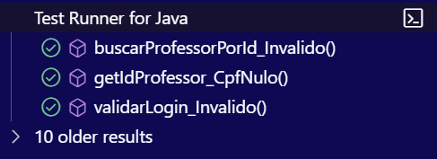

# EscolaJava4

---

# Sistema de Gestão Escolar

## Contexto do Projeto
O Sistema de Gestão Escolar será uma aplicação desktop desenvolvida em Java, utilizando Swing para a construção da interface gráfica. A aplicação permitirá que um administrador faça o cadastro de professores e alunos. Os professores poderão associar suas matérias e lançar notas para os alunos, que poderão visualizar suas notas e gerar o boletim das suas disciplinas.

---

## Escopo do Projeto
O Sistema de Gestão Escolar visa gerenciar o cadastro de professores e alunos, permitindo que os professores lancem notas e adicionem anotações de recuperação para os alunos. A arquitetura do sistema será construída com uma interface gráfica intuitiva e de fácil utilização, que possibilita futuras expansões, como a inclusão de funcionários administrativos.

---

## Objetivos Gerais
- Desenvolver um sistema de gerenciamento escolar simples e eficiente com uma interface gráfica local.
- Permitir que professores lancem notas e compartilhem anotações de recuperação com os alunos.
- Criar uma interface gráfica acessível e fácil de usar, dispensando um ambiente web.
- Facilitar a expansão do sistema para incluir módulos adicionais no futuro.

---

## Objetivos Específicos
- Implementar um sistema de cadastro para professores e alunos, com associações entre professores e matérias.
- Permitir que os professores lancem e atualizem notas e adicionem observações de recuperação para alunos específicos.
- Criar uma interface em Swing para facilitar a interação entre os usuários e o sistema.
- Estabelecer uma arquitetura modular para fácil manutenção e adição de novas funcionalidades.

---

## Objetivos Mensuráveis
- **Meta de Usuários:** Registrar todos os alunos e professores dentro de três meses de uso da aplicação.
- **Lançamento de Notas:** Permitir que os professores insiram e atualizem as notas para todas as matérias e alunos no primeiro semestre letivo.
- **Desempenho:** Garantir que todas as operações na interface gráfica (cadastros, visualizações e lançamentos de notas) ocorram em menos de 1 segundo.

---

## Objetivos Atingíveis
- Utilizar Java e a biblioteca Swing para construir uma interface gráfica robusta e amigável.
- Implementar um banco de dados PostgreSQL para armazenar informações sobre alunos, professores, notas e matérias.
- Adotar uma arquitetura modular que permita futuras expansões e atualizações de forma simples.

---

## Objetivos Relevantes
- Criar uma aplicação que atenda às necessidades de professores e alunos, fornecendo um meio eficiente de lançar e visualizar notas.
- Proporcionar uma interface gráfica intuitiva para usuários com pouca experiência técnica.
- Automatizar o processo de gerenciamento de notas, reduzindo o trabalho manual dos professores e facilitando o acesso dos alunos às suas informações acadêmicas.

---

## Objetivos Temporais

**Fase 1 (Mês 1 a 2):**
- Definir o escopo detalhado do projeto.
- Implementar o banco de dados PostgreSQL para armazenamento de dados.
- Desenvolvimento inicial da interface gráfica com Swing para o cadastro de professores e alunos.

**Fase 2 (Mês 3 a 4):**
- Implementação das funcionalidades principais: cadastro de matérias, lançamento de notas e criação de anotações de recuperação.
- Testes e ajustes na interface gráfica para garantir uma experiência de usuário fluida.
- Implementação de funcionalidades para a visualização de notas pelos alunos.

**Fase 3 (Mês 5):**
- Expansão da aplicação para incluir a possibilidade de adicionar funcionários avulsos (futuros módulos).
- Testes de desempenho e otimização da aplicação.
- Lançamento da versão funcional completa do sistema e ajustes pós-lançamento.

---

## Análise de Riscos

**Problemas Potenciais e Soluções:**

- **Problemas de Usabilidade Inicial:**  
  *Impacto:* Professores e alunos podem ter dificuldade em utilizar a interface gráfica.  
  *Soluções:* Fornecer treinamento básico e documentação simplificada para os usuários.

- **Desempenho do Banco de Dados:**  
  *Impacto:* Com o aumento do número de registros, o desempenho do banco de dados pode diminuir.  
  *Soluções:* Implementar índices nas tabelas e realizar manutenções periódicas no banco de dados.

- **Problemas de Integração Futuras:**  
  *Impacto:* Ao adicionar novos módulos (como funcionários), o sistema pode se tornar mais complexo.  
  *Soluções:* Manter uma arquitetura modular desde o início, permitindo integração fácil de novas funcionalidades.

---

## Recursos

**Tecnológicos:**
- Linguagem de Programação: Java SE (Standard Edition).
- Interface Gráfica: Swing.
- Banco de Dados: PostgreSQL para armazenamento local de dados.
- Gerenciador de Dependências: Maven para gerenciamento de bibliotecas e dependências do projeto.
- Segurança: Validação de dados inseridos na aplicação, com controle de acesso para diferentes tipos de usuários (professores, alunos).

**Humanos:**
- Desenvolvedores com experiência em Java e construção de interfaces gráficas com Swing.
- Testadores para verificar a funcionalidade e usabilidade da interface gráfica.
- Suporte técnico para auxiliar os usuários durante a fase de adoção inicial.

---

## Criação das Tabelas:

**Admin:**

- CREATE TABLE Admin (
-    id SERIAL PRIMARY KEY,
-    nome VARCHAR(255) NOT NULL,
-   cpf VARCHAR(11) NOT NULL UNIQUE,
-    senha VARCHAR(255) NOT NULL
- );

**Aluno:**

- CREATE TABLE Aluno (
-    id SERIAL PRIMARY KEY,
-    anoEscolar VARCHAR(50) NOT NULL,
-    turno VARCHAR(50) NOT NULL,
-    pessoa_id INT,
-    FOREIGN KEY (pessoa_id) REFERENCES Pessoa(id) ON DELETE CASCADE
- );

**Pessoa:**

- CREATE TABLE Pessoa (
-    id SERIAL PRIMARY KEY,
-    nome VARCHAR(255) NOT NULL,
-    cpf VARCHAR(11) NOT NULL UNIQUE,
-    senha VARCHAR(255) NOT NULL
- );

**Professor:**

- CREATE TABLE Professor (
-   id SERIAL  PRIMARY KEY,
-    materia_id INT,
-    salario DECIMAL(10, 2) NOT NULL,
-    pessoa_id INT,
-    FOREIGN KEY (materia_id) REFERENCES Materia(id),
- );

**Matéria:**

- CREATE TABLE Materia (
-    id SERIAL PRIMARY KEY,
-    nome VARCHAR(255) NOT NULL
- );

**Nota:**

- CREATE TABLE notas (
-    id SERIAL PRIMARY KEY,
-    id_aluno INT NOT NULL,
-    id_materia INT NOT NULL,
-    bimestre INT NOT NULL,
-    nota1 DOUBLE PRECISION,
-    nota2 DOUBLE PRECISION,
-    nota3 DOUBLE PRECISION,
-    nota4 DOUBLE PRECISION,
-    nota5 DOUBLE PRECISION,
-    faltas INT DEFAULT 0,
-    FOREIGN KEY (id_aluno) REFERENCES alunos(id),
-    FOREIGN KEY (id_materia) REFERENCES materias(id)
- );

---

## Testes Unitários

%TESTC  3 v2
%TSTTREE2,ProfessorServiceTest,true,3,false,1,ProfessorServiceTest,,[engine:junit-jupiter]/[class:ProfessorServiceTest]
%TSTTREE3,getIdProfessor_CpfNulo(ProfessorServiceTest),false,1,false,2,getIdProfessor_CpfNulo(),,[engine:junit-jupiter]/[class:ProfessorServiceTest]/[method:getIdProfessor_CpfNulo()]
%TSTTREE4,validarLogin_Invalido(ProfessorServiceTest),false,1,false,2,validarLogin_Invalido(),,[engine:junit-jupiter]/[class:ProfessorServiceTest]/[method:validarLogin_Invalido()]
%TSTTREE5,buscarProfessorPorId_Invalido(ProfessorServiceTest),false,1,false,2,buscarProfessorPorId_Invalido(),,[engine:junit-jupiter]/[class:ProfessorServiceTest]/[method:buscarProfessorPorId_Invalido()]
%TESTS  3,getIdProfessor_CpfNulo(ProfessorServiceTest)

%TESTE  3,getIdProfessor_CpfNulo(ProfessorServiceTest)

%TESTS  4,validarLogin_Invalido(ProfessorServiceTest)

%TESTE  4,validarLogin_Invalido(ProfessorServiceTest)

%TESTS  5,buscarProfessorPorId_Invalido(ProfessorServiceTest)

%TESTE  5,buscarProfessorPorId_Invalido(ProfessorServiceTest)

%RUNTIME1158

**Tests Results**

---

## Desenvolvimento

**Diagrama de Fluxo:**

**Diagrama de Classes:**

**Diagrama de Uso:**

# Manual do Usuário

---

## Visão Geral

Bem-vindo! Este sistema foi projetado para facilitar o gerenciamento de notas, e informações dos alunos e professores, garantindo uma comunicação clara entre os mesmos.

### Funcionalidades principais:

- Cadastro e login de professores e alunos.
- Professores podem cadastrar e consultar notas dos alunos.
- Alunos podem visualizar suas notas e anotações de recuperação.
- Sistema de autenticação seguro com gerenciamento de perfil.

## Acesso ao Sistema

1.O sistema deve ser aberto por meio da aplicação em Java.

## Login de Administradores

1. Acesse a página de Login e coloque suas credenciais.

## Funcionalidades de Adiministradores

1. Cadastrar Alunos.
2. Cadastrar Professores.
3. Cadastrar Matérias.
4. Ver todos os Usuários.
5. Editar os Usuários.
6. Exlcuir os Usuários.

### Login de Professores

1. Acesse a página inicial do sistema.
2. Clique no botão **Login** no topo da página.
3. Insira seu CPF e senha.
4. Clique em **Entrar** para acessar sua área de professor.

**Problemas de acesso:** Caso tenha esquecido a senha, entre em contato com o administrador do sistema para redefinir.

### Login de Alunos

1. Acesse a página inicial do sistema.
2. Clique no botão **Login** no topo da página.
3. Insira seu CPF e senha.
4. Clique em **Entrar** para acessar sua área de aluno.

## Funcionalidades para Professores

1. Atribuir as notas de um determinado bimestre aos alunos.
2. Editar as Notas.
3. Visualizar as Notas.

### Cadastrar Notas

1. Faça o login como Professor.
2. Selecione o aluno para o qual deseja cadastrar a nota.
3. Preencha a nota no campo apropriado.
4. Clique em **Salvar** para registrar a nota no sistema.

### Consultar Notas dos Alunos

1. Faça cadastro como Aluno.
2. As notas atribuídas aparecerão na tela.

## Funcionalidades para Alunos

1.Visualizar as Notas

## Encerrando a Sessão

Para sair do sistema, clique no botão **Sair** no canto superior direito da tela. Você será redirecionado para a página de login.

